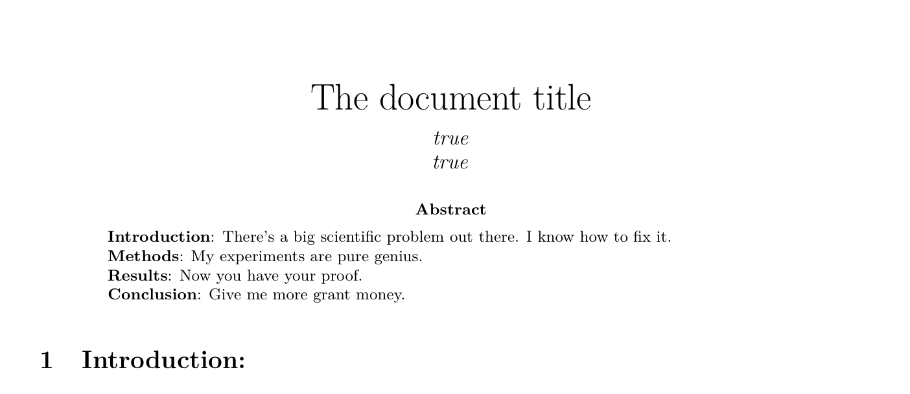
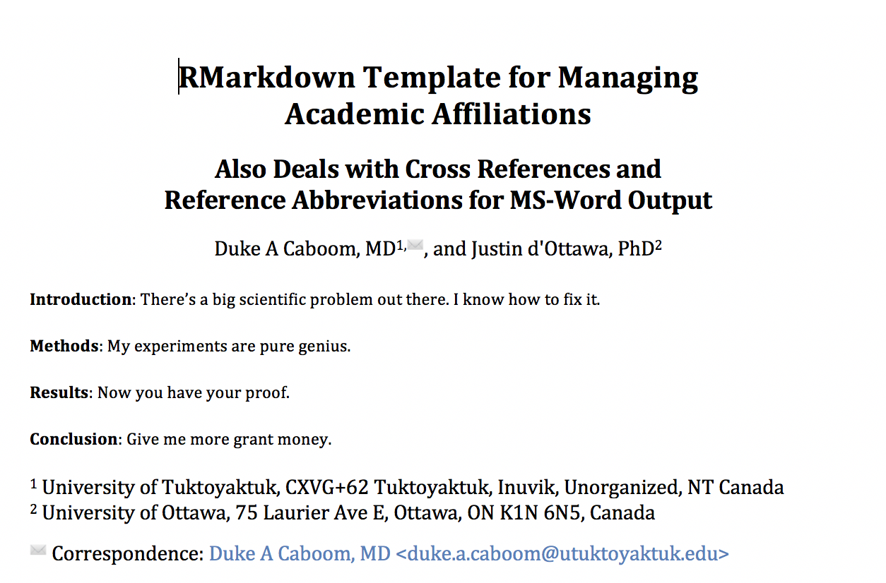
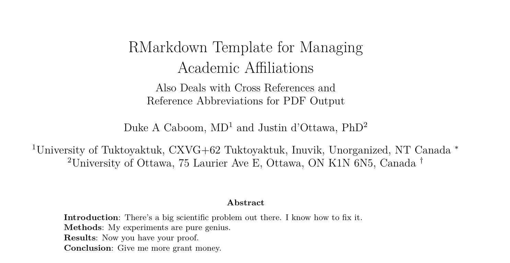

# Background

I like writing my academic papers in RMarkdown because it allows reproducible research. The cleanest way to submit a manuscript made in RMarkdown is using the LaTeX code that it generates using the YAML switch `keep_tex = true`. A minimalist YAML header would look like so:

```
---
title: The document title
author: 
  - Duke A Caboom, MD
  - Justin d'Ottawa, PhD:
output: 
  pdf_document:
    keep_tex: true
---
```
# Introduction 

However, when you want mutliple authors affiliations you discover that you can't do as you would in LaTeX because [Pandoc]() does not know what to do with the affiliations and you end out a dishearting PDF that looks like the output shown in figure \@ref(fig:sosad) below:

```{r sosad, echo=FALSE, fig.cap="This is so sad."}

```

The situation worsens if you want MS-Word output.  As those of us in medical fields know, most journals, with some notable exceptions like the [Clinical Mass Spectrometry Journal](https://www.journals.elsevier.com/clinical-mass-spectrometry) and other Elsevier journals like [Clinical Biochemistry](https://www.journals.elsevier.com/clinical-biochemistry) and [Clinica Chimica Acta](https://www.journals.elsevier.com/clinica-chimica-acta), require submission of a document in MS-Word format which goes against all that Data Science and Reprodicible Research stands for. Parenthetically, it is my hope that since [AACC](www.aacc.org) has indicated to make Data Science a strategic priority for Lab Medicine, that they will soon accept submissons to [Clinical Chemistry](http://clinchem.aaccjnls.org/) and [Journal of Applied Laboratory Medicine](http://jalm.aaccjnls.org/) written reproducibly in RMardown or LaTeX. 

In the mean time, here are the workarounds for getting the affiliations to display correctly along with all the other stuff we want, namely, cross referencing of figures and tables and correct reference formatting and abbreviation of journal names. This allows you to avoid the horror of manually fixing your Word document after it generated from RMarkdown. In any case, let's start with MS-Word. 

# Dependencies for MS-Word and the Associated YAML

It goes without saying that you need to install LaTeX. LaTeX markup language is available here: [Mac](http://www.tug.org/mactex/), [Windows](https://miktex.org/download). For Linux, just install from the command line with your package manager. Do a full install with all the glorious bloat of all LaTeX packages. This saves many headaches in the future.

You will also need to install [Pandoc](https://pandoc.org/) which is the Swiss Army Knife of document conversion. It's going to turn LaTeX code into a .docx file for you. Mac users can do this with Homebrew on the terminal command line:

```
brew install pandoc
brew install pandoc-citeproc
brew install pandoc-crossref
```

There are some extra installs required to help Pandoc do its job. Install the prebuilt binaries if you can.

+ [pandoc-citeproc]()
+ [pandoc-crossref](https://github.com/lierdakil/pandoc-crossref)

Finally, you need to use some scripts written in the Lua scripting language which means you will need the language itself:
+ [lua language](https://www.lua.org/download.html)

And you will need two Lua scripts:

These are in Pandoc github repository:

+ [scholarly-metadata.lua](https://github.com/pandoc/lua-filters/tree/master/scholarly-metadata)
+ [author-info-blocks.lua](https://github.com/pandoc/lua-filters/tree/master/author-info-blocks)

You want the files named [scholarly-metadata.lua](https://raw.githubusercontent.com/pandoc/lua-filters/master/scholarly-metadata/scholarly-metadata.lua) and [author-info-blocks.lua](https://raw.githubusercontent.com/pandoc/lua-filters/master/author-info-blocks/author-info-blocks.lua).

You will need to choose a .csl file for your journal. This will tell Pandoc how to format the references. You can download the correct .csl file [here](https://www.zotero.org/styles). You will also need a journal abbreviations database. I have made one for you from the [Web of Science list](https://images.webofknowledge.com/images/help/WOS/A_abrvjt.html) and you can download it [here]().

You will need to creat a .bibtex database which is just your list of references. This can be exported from various reference managers or built by hand. Name the file `mybibfile.bib`.

Now follow the bouncing ball:

1. Go to the directory containing your .Rmd file.
2. Create a directory in it called "Extras"
3. Put the two Lua scripts, the Bibtex database, the abbreviations database and the .csl file into the "Extras" folder.
4. If you want to avoid Pandoc's goofy default .docx formatting, then put [this word document]() in the same folder.

OR

Download [the contents of this folder]() from my github folder that has everything set up as I describe above.

For two authors, your YAML will need to look like this:

```
title: |
  RMarkdown Template for Managing  
  Academic Affiliations 
subtitle: |
  Also Deals with Cross References and  
  Reference Abbreviations for MS-Word Output
author:
  - Duke A Caboom, MD:
      email: duke.a.caboom@utuktoyaktuk.edu
      institute: [UofT]
      correspondence: true
  - Justin d'Ottawa, PhD:
      email: justin@neverready.ca
      institute: [UofO]
      correspondence: false
institute:
  - UofT: University of Tuktoyaktuk, CXVG+62 Tuktoyaktuk, Inuvik, Unorganized, NT Canada
  - UofO: University of Ottawa, 75 Laurier Ave E, Ottawa, ON K1N 6N5, Canada
abstract: |
  **Introduction**: There's a big scientific problem out there. I know how to fix it.
  **Methods**: My experiments are pure genius.
  **Results**: Now you have your proof.
  **Conclusion**: Give me more grant money.
journal: "An awesome journal"
date: ""
toc: false
output:
 bookdown::word_document2:
    pandoc_args:
      - --csl=Extras/clinical-biochemistry.csl
      - --citation-abbreviations=Extras/abbreviations.json
      - --filter=pandoc-crossref
      - --lua-filter=Extras/scholarly-metadata.lua
      - --lua-filter=Extras/author-info-blocks.lua
      - --reference-doc=Extras/Reference_Document.docx 
bibliography: "Extras/mybibfile.bib"
keywords: "CRAN, R, RMarkdown, RStudio, YAML"
```

Et voila! Figure \@ref(fig:sohappy) shows that we have something reasonable.

```{r sohappy, echo=FALSE, fig.cap="This is so great"}

```

# Dependencies for LaTeX and the Associated YAML

You don't need the lua scripts for LaTeX although you *can* use them. The issue with LaTeX is that the .tex template that Pandoc uses for generating LaTeX files does not support author affiliations as descibed [in the Pandoc documentation](https://pandoc.org/MANUAL.html). So what you need to do is modify the Pandoc LaTeX template. To get your current working copy of the Pandoc LaTeX template open up a terminal (Mac/Linux) and type:

```
pandoc -D latex > mytemplate.tex
```

This will push the contents to a file. Move the file to the "Extras" folder discussed above. If that seems difficult, you can also download it [here](https://github.com/jgm/pandoc-templates/blob/master/default.latex). Now you have to edit it. Open it up in a text editor and find the section that reads:

```
$if(author)$
\author{$for(author)$$author$$sep$ \and $endfor$}
$endif$
```
Replace this with this code that will invoke the LaTeX [authblk](https://www.ctan.org/pkg/authblk) package.

```
$if(author)$
	\usepackage{authblk}
	$for(author)$
		$if(author.name)$
			$if(author.number)$
				\author[$author.number$]{$author.name$}
			$else$
				\author[]{$author.name$}
			$endif$
			$if(author.affiliation)$
				$if(author.email)$
					\affil{$author.affiliation$ \thanks{$author.email$}}
				$else$
					\affil{$author.affiliation$}
				$endif$
			$endif$
			$else$	
			\author{$author$}
		$endif$
	$endfor$
$endif$
```

Then make your YAML header look like this:

```
---
title: |
  RMarkdown Template for Managing  
  Academic Affiliations 
subtitle: |
  Also Deals with Cross References and  
  Reference Abbreviations for PDF Output
author:
- name: Duke A Caboom, MD
  affiliation: University of Tuktoyaktuk, CXVG+62 Tuktoyaktuk, Inuvik, Unorganized, NT Canada
  email: dtholmes@mail.ubc.ca
  number: 1
- name: Justin d'Ottawa, PhD
  affiliation: University of Ottawa, 75 Laurier Ave E, Ottawa, ON K1N 6N5, Canada
  email: justin@neverready.ca
  number: 2
abstract: |
  **Introduction**: There's a big scientific problem out there. I know how to fix it.
  
  **Methods**: My experiments are pure genius.
  
  **Results**: Now you have your proof.
  
  **Conclusion**: Give me more grant money.
toc: false
output: 
  bookdown::pdf_document2:
    pandoc_args:
      - --filter=pandoc-crossref
      - --csl=Extras/clinical-biochemistry.csl
      - --citation-abbreviations=Extras/abbreviations.json
      - --template=Extras/mytemplate.tex
bibliography: "Extras/mybibfile.bib"
keep-latex: true
```

And as you can see in \@ref(fig:sohappylatex) you get a correctly list of authors.

```{r sohappylatex, echo=FALSE, fig.cap="This is also great."}

```

## Cross Reference of a Table

Of course, tables can be cross referenced in the same manner as figures. Here is a cross reference to table \@ref(tab:mytable) using the code `\@ref(tab:mytable)` .

```{r mytable, echo = FALSE}
library(broom)
mod <- lm(mpg ~ hp + cyl, data = mtcars)
knitr::kable(tidy(mod), digits = 3, booktabs = TRUE, caption = "A short table")
```

## This Template also Takes Care of Reference Abbreviation.

As usual, you can make a citation with the code `[@bibtexname]`, where `bibtexname` is the articles's abbreviated handle in your bibtex database. Here is a great resource on the bookdown package [@xie2018r] and reproducible research [@peng2011reproducible] and here are references where the journal title is longer [@EISENHOFER201940; @VICENTE201984]. The references in your documnent (and shown below) will have appropriate abbreviations based on the .json abbreviations database I have provided. In this case, I have chosen the .csl file for Clinical Mass Spectrometry--'cause [MSACL](https://www.msacl.org/).


# Other Ways to Skin the YAML Cat

I came across some other ways to deal with this that I did not like as much but they are simpler. Here is one using a footnote.

```
title: The document title
author:
- [Duke A Caboom, MD]^(University of Tuktoyaktuk, CXVG+62 Tuktoyaktuk, Inuvik, Unorganized, NT Canada)
- [Justin d'Ottawa, PhD]^(University of Ottawa, 75 Laurier Ave E, Ottawa, ON K1N 6N5, Canada)
output: pdf_document
```

And you can also misuse the `date` variable:

```
title: The document title
author:
- Duke A Caboom, MD [1]
- Justin d'Ottawa, PhD [2]
date: 1. University of Tuktoyaktuk, CXVG+62 Tuktoyaktuk, Inuvik, Unorganized, NT Canada \newline 2. University of Ottawa, 75 Laurier Ave E, Ottawa, ON K1N 6N5, Canada
output: pdf_document
```

# Conclusion

This concludes my long personal struggle to get a completely reproducible .docx manusript genereated by RMardown and Pandoc.


## Parting Thought

**Let us not become weary in doing good, for at the proper time we will reap a harvest if we do not give up.**

**Galations 6:9**

# References
